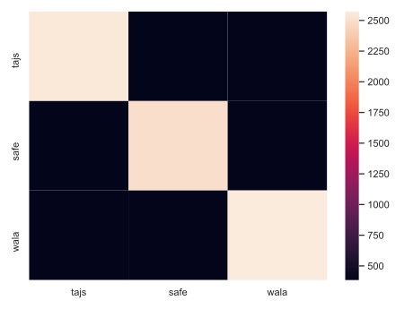

## JS Static Analysis Benchmark

- Compatibility
  - https://github.com/tc39/test262
  - https://www.sri.inf.ethz.ch/downloads/jsnice_git_repos.txt

Tools:
- safe: `88f17b1ab957ab43420c2564db5602a76b923bc3`
  - `sbt compile`
  - You need to set `SAFE_HOME` to the directory containing SAFE
- wala: see `pom.xml` for version
  - `make`
- tajs: `9c746c97ad063f8c891310f29bc39217076bafe2`
  - `git submodule update --init`
  - `ant`

## Results

Matrix of "ok" results:

Matrix of "failure" results:

[Path to total counts](counts.md)