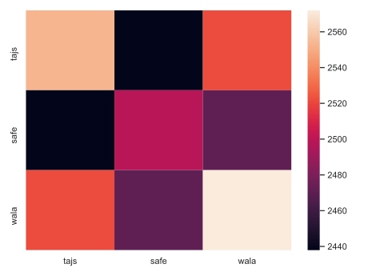

# JS Static Analysis Benchmark

The goal of this benchmark is to test the compatibility (esp. front-end parser) of various JS static analyzer.
The compatibility is important since JS is a language that is interpreted and has many variants and versions.

## Datasets

We randomly sampled a set of JavaScript files from the following sources:

- https://github.com/tc39/test262
- https://www.sri.inf.ethz.ch/downloads/jsnice_git_repos.txt

## Tools

We used three tools for now (SAFE, WALA, and TAJS). While there are many other tools, these three supports
data-flow analysis thus can be used for some special purposes. We include the version and build instructions here.

- safe: `88f17b1ab957ab43420c2564db5602a76b923bc3`
  - `sbt compile`
  - You need to set `SAFE_HOME` to the directory containing SAFE
- wala: see `pom.xml` for version
  - `make`
- tajs: `9c746c97ad063f8c891310f29bc39217076bafe2`
  - `git submodule update --init`
  - `ant`

## Results

**(c) Total counts**:

[Path to total counts](counts.md)

**(a) Matrix of "ok" results**:

**(b) Matrix of "failure" results**:

